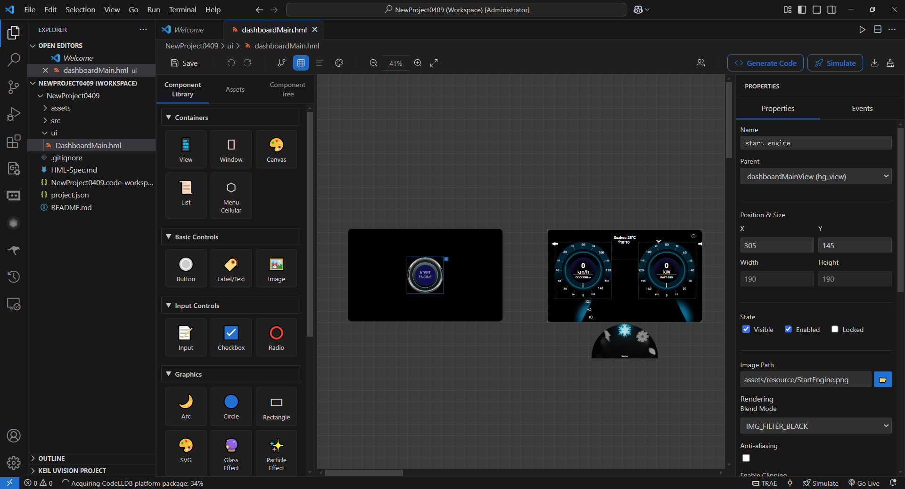

设计器使用
==========

HoneyGUI Visual Designer 提供了一个直观的可视化设计环境，支持拖放操作、实时预览和丰富的组件库。

设计器界面
-----------

界面布局
~~~~~~~~

设计器采用经典的四区域布局：

   设计器界面布局

1. **工具栏** （顶部）

   * 保存、撤销、重做按钮
   * 代码生成、编译仿真按钮
   * 网格设置、视图切换等辅助工具

2. **侧边栏** （左侧，支持 Tab 切换）

   * **Tab 1 - 组件库**：所有可用的 HoneyGUI 组件
   * **Tab 2 - 资源面板**：项目中的图片、字体、视频等资源
   * **Tab 3 - 组件树**：当前界面的组件层级结构

3. **画布** （中央）

   * 设计区域，显示实际界面效果
   * 支持缩放（25% - 800%）
   * 支持平移和网格吸附

4. **属性面板** （右侧）

   * 编辑选中组件的属性
   * 包括位置、尺寸、颜色、文本、事件等

工具栏功能
~~~~~~~~~~

常用操作
""""""""

* **保存**：保存当前设计到 HML 文件（``Ctrl+S``）
* **撤销**：撤销上一步操作（``Ctrl+Z``），支持 50 步历史
* **重做**：重做已撤销的操作（``Ctrl+Y``）
* **生成代码**：将 HML 文件转换为 C 代码
* **编译仿真**：启动完整的编译和仿真流程

视图工具
""""""""

* **缩放**：调整画布显示比例（25% - 800%）

  * 放大：``Ctrl`` + ``+``
  * 缩小：``Ctrl`` + ``-``
  * 重置：``Ctrl`` + ``0``

* **网格设置**：配置网格大小和吸附

  * 默认网格大小：8px
  * 可在设置中修改：``honeygui.ui.gridSize``

* **视图切换**：切换到其他 HML 视图文件

组件库
-------

组件分类
~~~~~~~~

HoneyGUI 提供丰富的组件，分为以下几类：

容器组件
""""""""

* **hg_view**：视图容器，用于组织界面布局
* **hg_window**：窗口容器，支持多窗口管理

基础控件
""""""""

* **hg_button**：按钮，支持文本和图标
* **hg_label**：文本标签，支持多行文本
* **hg_image**：图片显示，支持多种格式
* **hg_switch**：开关按钮，支持开/关状态

输入控件
""""""""

* **hg_input**：文本输入框
* **hg_checkbox**：复选框
* **hg_radio**：单选按钮

高级控件
""""""""

* **hg_progressbar**：进度条
* **hg_slider**：滑动条
* **hg_canvas**：自定义绘图画布
* **hg_list**：列表容器，支持滚动

多媒体组件
""""""""""

* **hg_video**：视频播放器
* **hg_3d**：3D 模型显示

使用组件
~~~~~~~~

添加组件
""""""""

1. 在左侧组件库中找到需要的组件
2. 点击并拖动到画布中
3. 松开鼠标，组件会添加到当前位置
4. 组件会自动吸附到网格（如果启用）

.. tip::
   可以按住 ``Shift`` 键禁用网格吸附，实现像素级精确定位。

从资源面板添加
""""""""""""""

对于图片资源，可以直接从资源面板拖放：

1. 切换到 **Tab 2 - 资源面板**
2. 拖动图片到画布
3. 会自动创建 ``hg_image`` 组件并设置图片路径

画布操作
---------

选择组件
~~~~~~~~

单选
""""

* 点击画布中的组件即可选中
* 选中的组件会显示蓝色边框和控制点

多选
""""

* 按住 ``Ctrl`` 键，依次点击多个组件
* 或按住鼠标左键拖出矩形框，框选多个组件

移动组件
~~~~~~~~

* 拖动选中的组件到新位置
* 多选时，所有选中的组件会一起移动
* 移动时会显示参考线，辅助对齐

调整尺寸
~~~~~~~~

* 选中组件后，拖动边缘的控制点
* 八个控制点分别对应八个方向
* 按住 ``Shift`` 键可以等比例缩放

对齐和分布
~~~~~~~~~~

选中多个组件后，可以使用对齐和分布工具：

* **左对齐**：所有组件左边缘对齐
* **右对齐**：所有组件右边缘对齐
* **顶部对齐**：所有组件顶部对齐
* **底部对齐**：所有组件底部对齐
* **水平居中**：所有组件水平居中对齐
* **垂直居中**：所有组件垂直居中对齐
* **水平分布**：均匀分布组件的水平间距
* **垂直分布**：均匀分布组件的垂直间距

组件层级
~~~~~~~~

右键菜单提供层级调整选项：

* **置于顶层**：将组件移到最上层
* **置于底层**：将组件移到最下层
* **上移一层**：向上移动一层
* **下移一层**：向下移动一层

组件树
-------

组件树位于左侧 **Tab 3**，显示当前界面的组件层级结构。

树形结构
~~~~~~~~

* 父组件可以包含多个子组件
* 子组件可以继续嵌套
* 拖动组件可以改变父子关系

.. code-block:: text

   main_view (hg_view)
   ├── header (hg_view)
   │   ├── title (hg_label)
   │   └── logo (hg_image)
   ├── content (hg_view)
   │   ├── btn1 (hg_button)
   │   ├── btn2 (hg_button)
   │   └── list (hg_list)
   └── footer (hg_view)

树形操作
~~~~~~~~

* **点击**：选中组件（画布会同步高亮）
* **拖动**：改变组件的父子关系或顺序
* **右键**：显示上下文菜单

  * 复制、粘贴、删除
  * 重命名组件 ID
  * 调整层级

* **展开/折叠**：点击节点前的箭头

.. tip::
   使用组件树可以方便地管理复杂的嵌套结构，特别是当画布上组件重叠时。

属性面板
---------

属性面板位于右侧，显示选中组件的所有可配置属性。

基础属性
~~~~~~~~

所有组件都具有的属性：

* **ID**：组件的唯一标识符

  * 必须唯一
  * 只能包含字母、数字、下划线
  * 用于代码生成和事件绑定

* **位置和尺寸**

  * ``x``：水平位置（相对父组件）
  * ``y``：垂直位置（相对父组件）
  * ``w``：宽度
  * ``h``：高度

* **可见性**

  * ``visible``：是否可见
  * ``opacity``：透明度（0-255）

* **旋转和缩放**

  * ``rotation``：旋转角度
  * ``scaleX``：水平缩放比例
  * ``scaleY``：垂直缩放比例

特定属性
~~~~~~~~

不同组件有不同的特定属性：

hg_button
"""""""""

* ``text``：按钮文字
* ``fontSize``：字体大小
* ``textColor``：文字颜色
* ``backgroundColor``：背景颜色
* ``normalImage``：正常状态图片
* ``pressedImage``：按下状态图片

hg_label
""""""""

* ``text``：文本内容（支持多行）
* ``fontSize``：字体大小
* ``fontColor``：字体颜色
* ``fontFamily``：字体文件路径
* ``textAlign``：对齐方式（left, center, right）
* ``lineHeight``：行高

hg_image
""""""""

* ``src``：图片文件路径
* ``mode``：显示模式（fill, fit, stretch）
* ``rotation``：旋转角度

hg_progressbar
""""""""""""""

* ``min``：最小值
* ``max``：最大值
* ``value``：当前值
* ``color``：进度条颜色
* ``backgroundColor``：背景颜色

事件属性
~~~~~~~~

组件可以配置事件响应：

* **onClick**：点击事件
* **onLongPress**：长按事件
* **onSwipe**：滑动事件
* **onChange**：值改变事件

详见 :doc:`事件系统 <event_system>` 章节。

颜色选择器
~~~~~~~~~~

对于颜色属性，属性面板提供颜色选择器：

* 点击颜色方块打开选择器
* 支持 RGB、HSL 色彩模式
* 可以直接输入十六进制颜色值（如 ``#FF0000``）
* 支持透明度设置

键盘快捷键
-----------

编辑操作
~~~~~~~~

* ``Ctrl+S``：保存
* ``Ctrl+Z``：撤销
* ``Ctrl+Y``：重做
* ``Ctrl+C``：复制
* ``Ctrl+V``：粘贴
* ``Ctrl+X``：剪切
* ``Delete``：删除选中组件

视图操作
~~~~~~~~

* ``Ctrl``  + ``+``：放大画布
* ``Ctrl``  + ``-``：缩小画布
* ``Ctrl``  + ``0``：重置缩放
* ``Space``  + 拖动：平移画布

选择操作
~~~~~~~~

* ``Ctrl``  + 点击：多选
* ``Ctrl``  + ``A``：全选
* ``Esc``：取消选择

精确定位
~~~~~~~~

* ``方向键``：移动组件 1 像素
* ``Shift``  + 方向键：移动组件 10 像素
* ``Shift``  + 拖动：禁用网格吸附

右键菜单
---------

在画布上右键点击组件，会显示上下文菜单：

组件操作
~~~~~~~~

* **复制** （``Ctrl+C``）
* **粘贴** （``Ctrl+V``）
* **删除** （``Delete``）
* **重命名**：修改组件 ID

层级调整
~~~~~~~~

* **置于顶层**
* **置于底层**
* **上移一层**
* **下移一层**

组件组织
~~~~~~~~

* **组合为容器**：将多个组件放入新的 ``hg_view``
* **取消组合**：从容器中移出子组件

代码操作
~~~~~~~~

* **查看生成的代码**：预览此组件对应的 C 代码
* **复制代码**：复制生成的代码到剪贴板

最佳实践
---------

组件命名
~~~~~~~~

* 使用有意义的 ID：``login_button`` 而不是 ``button1``
* 遵循命名规范：使用小写字母和下划线
* 避免特殊字符和中文

布局技巧
~~~~~~~~

* 使用容器（``hg_view``）组织相关组件
* 善用网格吸附，保持对齐
* 利用组件树管理复杂嵌套

性能优化
~~~~~~~~

* 避免过深的组件嵌套（建议不超过 5 层）
* 对于大型界面，考虑分割成多个 HML 文件
* 隐藏不可见的组件，减少渲染开销

协同开发
~~~~~~~~

* 定期保存和同步 HML 文件
* 使用版本控制（如 Git）管理 HML 文件
* 避免多人同时编辑同一个 HML 文件

下一步
-------

* 了解 :doc:`HML 文件格式 <hml_format>` 进行手动编辑
* 掌握 :doc:`事件系统 <event_system>` 实现交互
* 学习 :doc:`代码生成机制 <code_generation>` 理解代码结构
