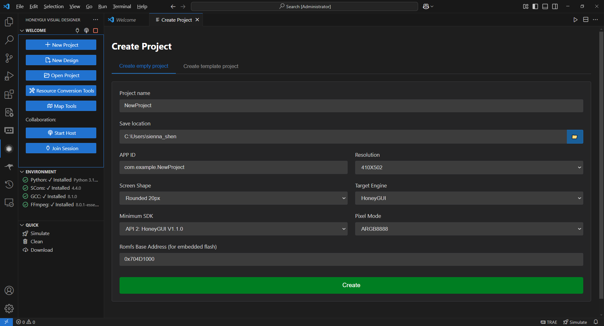
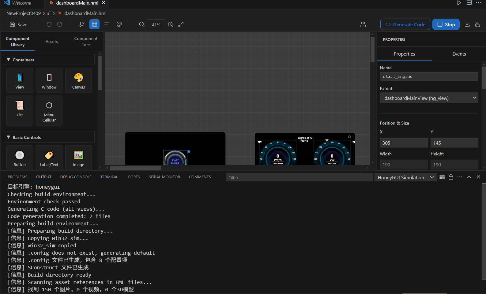

快速开始
========

本章节介绍如何安装 HoneyGUI Visual Designer 插件并创建第一个 GUI 应用程序。

安装要求
---------

软件环境
~~~~~~~~

* **VSCode**：版本 1.60.0 或更高
* **Python**：3.9.7 或更高版本
* **SCons**：4.4.0 (通过 ``pip install scons==4.4.0`` 安装)
* **kconfiglib**：通过 ``pip install kconfiglib`` 安装

**Windows 平台**：

* MinGW-w64 (推荐 8.1.0 版本)，安装路径 ``C:\mingw64``
* CMake 3.31.2+ (可选，用于 CMake 构建方式)

**Linux/WSL 平台**：

* GCC 工具链
* SDL2 开发库：``sudo apt-get install libsdl2-dev``

安装插件
---------

方法一：从 VSCode 市场安装
~~~~~~~~~~~~~~~~~~~~~~~~~~~

1. 打开 VSCode
2. 点击左侧活动栏的扩展图标（或按 ``Ctrl+Shift+X``）
3. 在搜索框中输入 **"HoneyGUI Visual Designer"**
4. 点击 **安装** 按钮

方法二：从 VSIX 文件安装
~~~~~~~~~~~~~~~~~~~~~~~~~

1. 下载插件的 ``.vsix`` 文件
2. 在 VSCode 中，打开扩展面板
3. 点击右上角的 **...** 菜单
4. 选择 **从 VSIX 安装...**
5. 选择下载的 VSIX 文件

环境检查
---------

安装完成后，插件会自动检查开发环境：

1. 打开 VSCode 命令面板（``Ctrl+Shift+P``）
2. 输入并执行 ``HoneyGUI: Check Environment``
3. 查看终端输出，确认所有依赖项已安装

.. note::
   如果环境检查失败，请根据错误提示安装缺失的依赖项。

创建第一个项目
---------------

使用项目模板
~~~~~~~~~~~~

1. 点击 VSCode 左侧活动栏的 HoneyGUI 图标
2. 在侧边栏中点击 **新建项目** 按钮
3. 选择项目模板：

   * **空白项目**：从零开始设计界面
   * **Watch 项目**：智能手表界面模板（410x502）
   * **Dashboard 项目**：仪表盘界面模板（800x480）

4. 输入项目名称
5. 选择项目保存位置
6. 插件会自动创建项目结构并初始化

   创建新项目

项目结构
~~~~~~~~~

创建后的项目包含以下结构：

.. code-block:: text

   my-project/
   ├── project.json          # 项目配置文件
   ├── views/                # HML 界面文件目录
   │   └── main.hml          # 主界面
   ├── src/                  # 生成的 C 代码
   │   ├── ui/               # UI 结构代码（自动生成）
   │   ├── callbacks/        # 回调函数（自动生成框架）
   │   └── user/             # 用户代码（手动编写）
   ├── assets/               # 资源文件目录
   │   ├── images/           # 图片资源
   │   ├── fonts/            # 字体资源
   │   └── videos/           # 视频资源
   └── SConstruct            # SCons 构建脚本

设计界面
---------

打开设计器
~~~~~~~~~~

1. 在 VSCode 文件浏览器中双击 ``.hml`` 文件
2. 设计器会在编辑器区域打开，显示可视化设计界面

.. figure:: resource/design-ui.png
   :align: center
   :width: 800px

   可视化设计器界面

设计器界面说明
~~~~~~~~~~~~~~

* **工具栏**：提供保存、撤销、重做等常用操作
* **组件库**（左侧）：包含所有可用的 HoneyGUI 组件
* **画布**（中央）：设计区域，显示实际界面效果
* **组件树**（右上）：显示当前界面的组件层级结构
* **属性面板**（右下）：编辑选中组件的属性

添加组件
~~~~~~~~

1. 从左侧组件库中选择一个组件（如 ``hg_button``）
2. 拖动到画布中间
3. 松开鼠标，组件会添加到界面上
4. 在右侧属性面板中修改组件属性：

   * 位置和尺寸
   * 文本内容
   * 颜色和样式
   * 事件绑定

基本操作
~~~~~~~~

* **选择组件**：点击画布中的组件
* **移动组件**：拖动选中的组件
* **调整尺寸**：拖动组件边缘的控制点
* **删除组件**：选中后按 ``Delete`` 键
* **复制粘贴**：``Ctrl+C`` / ``Ctrl+V``
* **撤销重做**：``Ctrl+Z`` / ``Ctrl+Y``

生成代码
---------

自动代码生成
~~~~~~~~~~~~

设计完成后，插件会自动生成 C 代码：

1. 点击工具栏的 **生成代码** 按钮，或使用命令面板：

   .. code-block:: text

      Ctrl+Shift+P → HoneyGUI: Generate Code

2. 插件会扫描 ``views/`` 目录下的所有 HML 文件
3. 自动生成以下文件：

   * ``src/ui/*.c`` - UI 结构代码（每次重新生成）
   * ``src/callbacks/*.c`` - 回调函数框架（仅首次生成）
   * ``src/user/*.c`` - 用户代码（手动编写，永不覆盖）

代码保护区
~~~~~~~~~~

生成的代码包含保护区标记，用户可以在保护区内添加自定义逻辑：

.. code-block:: c

   // @protected start
   // 在这里添加您的代码
   void on_button_click(void *obj, gui_event_t *event) {
       printf("Button clicked!\n");
   }
   // @protected end

.. warning::
   保护区外的代码会在重新生成时被覆盖，请务必将自定义代码写在保护区内。

编译仿真
---------

编译项目
~~~~~~~~

1. 点击工具栏的 **▶ 编译仿真** 按钮
2. 或使用命令面板：``HoneyGUI: Build and Simulate``
3. 插件会自动执行：

   * 转换资源文件（图片、字体等）
   * 编译 C 代码（使用 SCons）
   * 启动仿真器

   编译仿真

运行仿真器
~~~~~~~~~~

编译成功后，仿真器窗口会自动弹出，显示设计的界面。

* **鼠标操作**：模拟触摸屏
* **键盘操作**：支持部分快捷键
* **实时调试**：可以通过 GDB 或 printf 调试

常见问题
~~~~~~~~~

**编译失败**：

1. 检查环境变量是否正确配置
2. 确认 MinGW/GCC 路径是否正确
3. 查看终端输出的错误信息

**仿真器无法启动**：

1. 检查 SDL2 库是否已安装
2. 在 Linux 上：``sudo apt-get install libsdl2-dev``
3. 在 Windows 上：确认 MinGW 包含 SDL2

下一步
-------

* 学习 :doc:`设计器使用 <designer>` 了解更多设计技巧
* 了解 :doc:`HML 文件格式 <hml_format>` 进行高级定制
* 掌握 :doc:`事件系统 <event_system>` 实现交互功能
* 探索 :doc:`资源管理 <resource_management>` 优化资源使用
