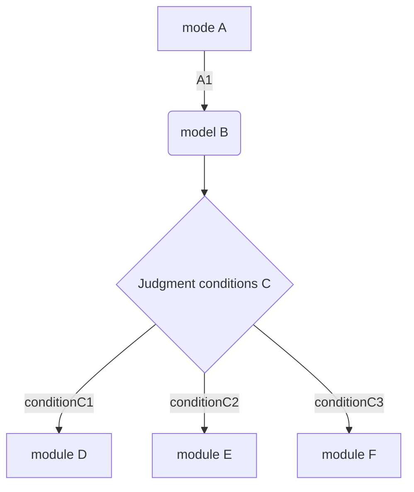

## Design details

# sw acc


# image type

|  |  |  |  |
| --- | --- | --- | --- |
|  |  |  |  |
|  |  |  |  |
|  |  |  |  |
|  |  |  |  |
|  |  |  |  |
|  |  |  |  |
|  |  |  |  |


# todo
```chart
,Budget,Income,Expenses,Debt
June,5000,8000,4000,6000
July,3000,1000,4000,3000
Aug,5000,7000,6000,3000
Sep,7000,2000,3000,1000
Oct,6000,5000,4000,2000
Nov,4000,3000,5000,

type: pie
title: Monthly Revenue
x.title: Amount
y.title: Month
y.suffix: $
```


