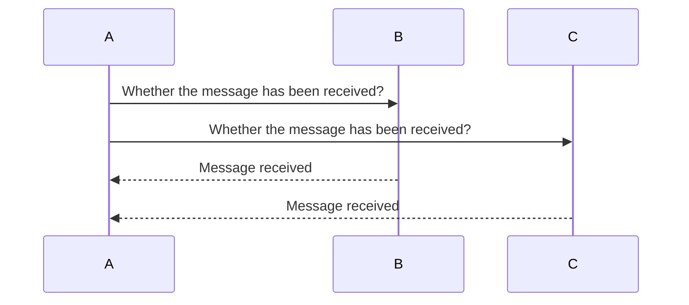

##  How to swtich app from app
### Introduction

```mermaid
sequenceDiagram
A->>B: Whether the message has been received?
A->>C: Whether the message has been received?
B-->>A: Message received
C-->>A: Message received

```

### Source File
### Example
### Two Steps

