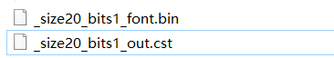

# GUI-APP: UI resource font

## Font bin generate

### Generate a font library example

#### The following uses the Font Convert Tool-v0.0.0.3 version as an example

 1. Copy the Font library file to the Font Convert Tool -v0.0.0.3 \Font
   

 2. Edit FontConfig.json
    Take HarmonyOS_Sans_SC_Regular.ttf with width 20 and height 20, ASCII display characters and Chinese today is Thursday as an example
    

 3. Double-click fontDirctionary.exe
 4. Generated successfully
   
   
    Build failure

    
    
    You need to check whether FontConfig.json is correctly configured

## FontConfig.json Parameter description

| field name | Field meaning|
| ----- | ---- |
| codePages | A list of selected characters arranged in a specific order for the text of a language. Can be set multiple |
| cstPaths | Binary Unicode code table cst file path. Can be set multiple |
| mappingPaths|User - defined unicode character set file path. Multiple groups can be set|
|customerVals|User-defined continuous unicode characters. Multiple groups can be set|
|firstVal|The starting value of a custom continuous unicode character|
|range|A custom number of consecutive unicode character|
|fontSet|Used to specify font-related Settings to be converted|
|bold|Specifies whether converted characters are bolded|
|italic|Specifies whether the converted character is slanted|
|scanMode|Specifies how the converted character data is saved. If the value is "H", the fonts are saved by row, and if the value is "V", the fonts are saved by column|
|fontSize|Specifies the converted character size|
|font|Specifies the font file to use for the conversion|
|renderMode|Specifies how many bits are used to represent a pixel in the converted character bitmap|
|indexMethod|Specify the index mode of the re-index area of the output bin file after conversion, and fill the address index with 0; offset index 1|

   

   
    

   

