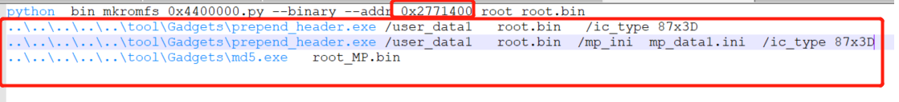

# GUI-APP: UI resource 


##  Packing a filesystem image
Take RTL8762D as an example as follows:
* Copy all the generated bin files to the folder ```\src\app\dashboard\application\root_image\root```.
* Double-click ```mkromfs_0xa00000.bat``` in the ```\src\app\dashboard\application\root_image``` directory to execute the script and generate an image of the root folder. A new .bin file and .h file will appear in the directory.
* Between them, .bin is the image file, and .h is the address offset of each file in the file system, which can be accessed directly without using the file system.


##  Additional information for RTL8763E and RTL8773DO
RTL8763E is the name of a series IC type, including RTL8763EWE-VP/RTL8763EW-VC. RTL8763E and RTL877DO have different packaging processes as follows. 
### Unzip userdata.zip
Unzip userdata.zip and move files in userdata.zip to sdk/src/sample/bt_audio_trx/panel/userdata.


### Set configuration 
Bat file has some distinctive due to IC type.
If IC is RTL8763EWE-VP or RTL8763EW-VC.


If IC is RTL8773DO.



Please set bat configuration due to own IC type.

### Generate userdata bin
Generate process as follows:
* Copy all the generated bin files to the folder ```\src\sample\bt_audio_trx\panel\user_data\root```.
* Double-click ```gen_root_image.bat``` in the ```\src\sample\bt_audio_trx\panel\user_data``` directory to execute the script and generate an image of the root folder. A new .bin file and .h file will appear in the directory.
* Between them, .bin is the image file, and .h is the address offset of each file in the file system, which can be accessed directly without using the file system.


